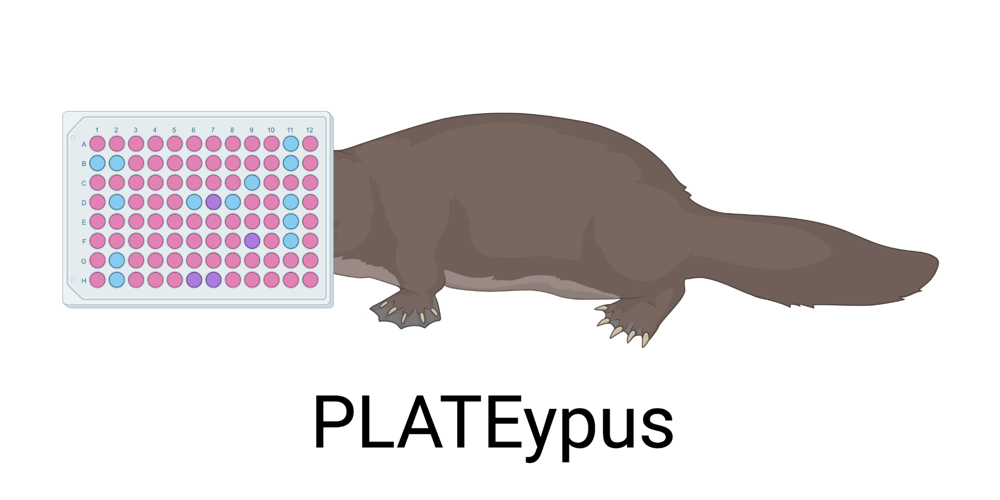

 
A simple GUI to process and plot bulk cytokine, surface marker, and single cell data exported from flowjo

To use this package:
1. Install via PyPi: pip install plateypus
2. In an anaconda environment, type python3 plateypus
